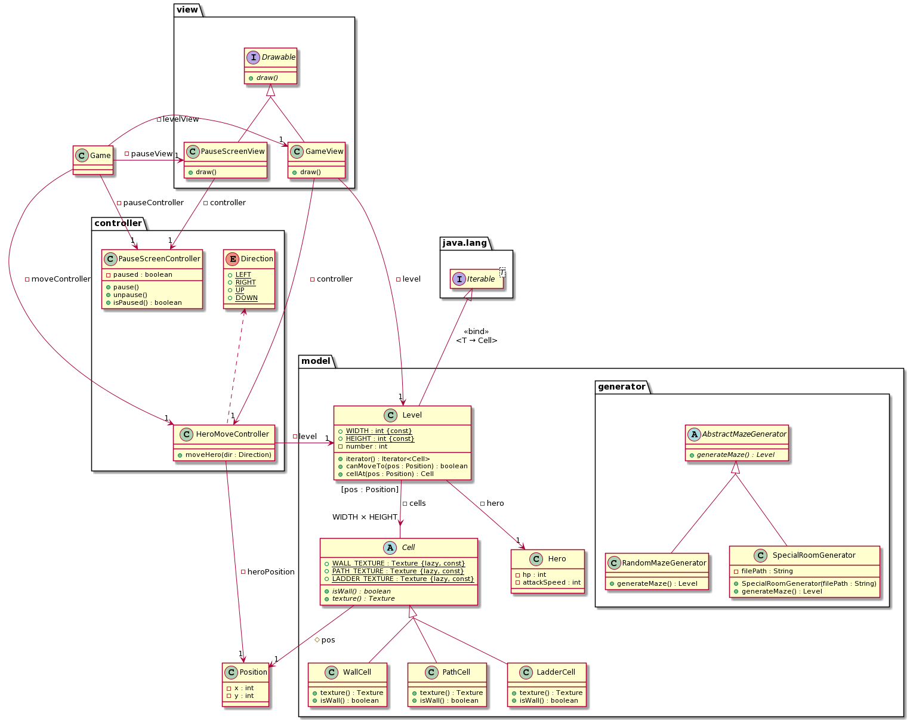
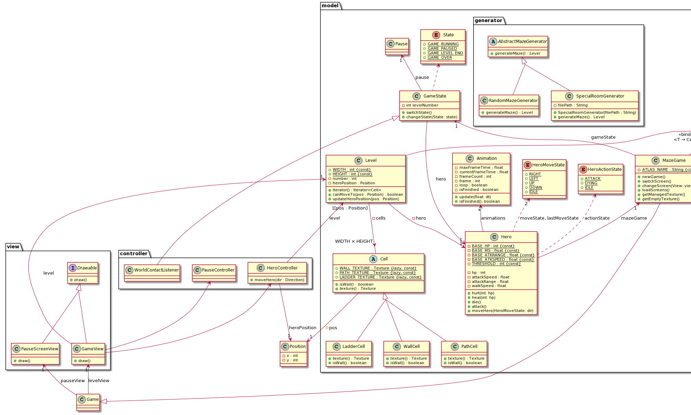
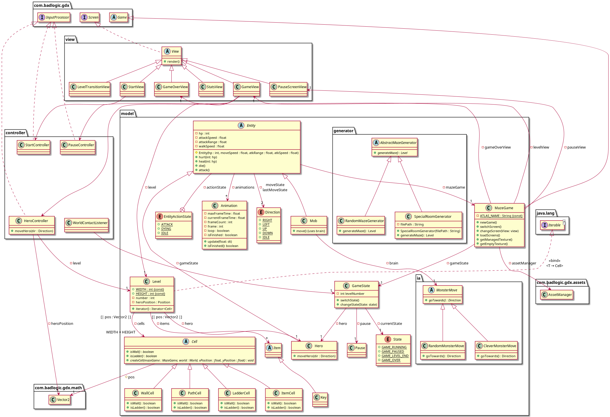
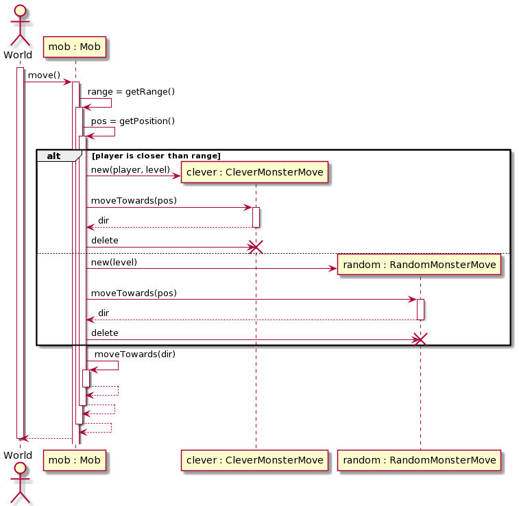
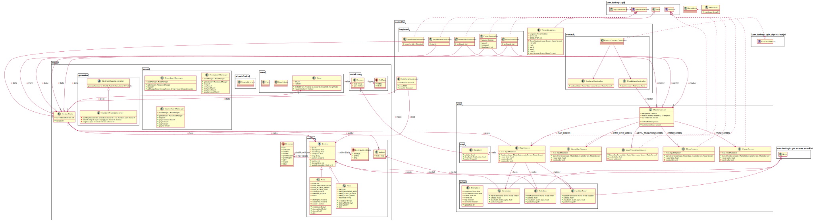
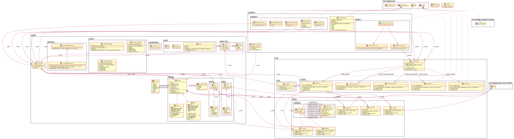
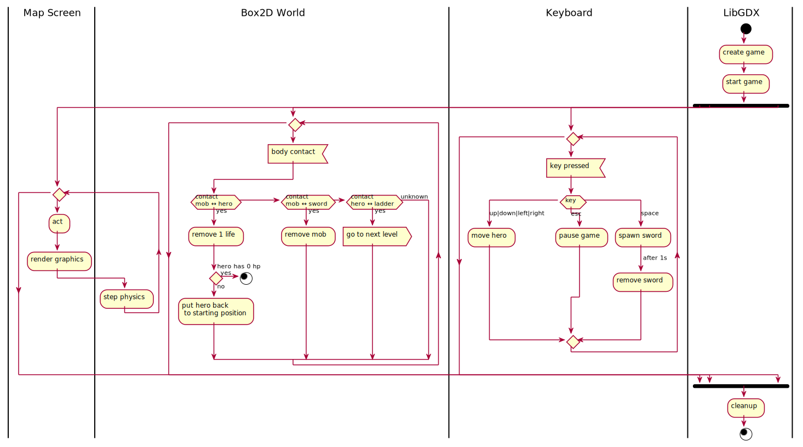

# Maze

## Dépendances

- Java 1.8+
- Maven 3
- (Linux) [libXxf86vm](https://github.com/freedesktop/libXxf86vm) pour l'affichage
- (Optionnel) [OpenAL](https://www.openal.org/) pour l'audio

## Lancement

Dans un terminal :
```bash
# On clone le dépôt...
git clone https://github.com/cerb1999/maze -b main
# ...et on se déplace dans sa racine
cd maze

# `mvn package` exécute les actions suivantes :
# - `validate` : validation du `pom.xml` et du projet
# - `compile` : compile les sources Java
# - `test` : exécute les tests
# - `package` : crée un fichier JAR dans `target/`
mvn package -P prod

# Le .jar se trouve maintenant dans `target/` si aucune erreur n'est survenue
# dans l'étape précédente
java -jar target/maze-2.0-SNAPSHOT.jar
```

Alternativement, le fichier `maze-2.0-SNAPSHOT.jar` est proposé en téléchargement direct [ici](https://github.com/Cerb1999/Maze/releases).

## Fonctionnalités envisagées

- Héros
  - [x] Le héros est placé aléatoirement sur une case du niveau
  - [X] Le héros dispose de trois vies, une puissance d'attaque et une vitesse de déplacement

- Labyrinthe
  - [x] Les niveaux sont générés aléatoirement.
  - [x] Le labyrinthe est généré à partir d’un fichier (pour les niveaux spéciaux).
  - [x] Le héros ne peut pas traverser les murs.
  - [x] les monstres ne peuvent pas traverser les murs
  - [x] Une partie commence au niveau 1.
  - [ ] Certaines cases du labyrinthe sont spéciales :
    - [ ] clé : requise pour accéder au prochain niveau
    - [x] échelle : aller au prochain niveau
    - [ ] pièges : piège classique sur une case, fait perdre une vie
    - [ ] magiques : si un personnage arrive sur la case un effet est déclenché
      - [ ] ralentissement
      - [ ] perte d'attaque
      - [ ] +1 vie
  - [x] Afficher le labyrinthe dans la console
  - [x] Afficher le labyrinthe graphiquement

- Monstres
  - [x] Des monstres sont placés de manière aléatoire dans le labyrinthe.
  - [x] Les monstres se déplacent
    - [x] aléatoirement dans un petit rayon quand le joueur est au délà de la portée de détection
    - [x] intelligemment (essaye de l'attraper) lorsque le joueur est dans la portée de détection du monstre.
 
- Attaques
  - [x] Le héros perd une vie au contact d’un monstre
    - [x] replacé au début du niveau (sans réapparation des objets).
  - [x] Le héros peut attaquer les monstres (corps à corps - case adjacente)
  - [ ] ((Attaque des monstres))
  
 - Autre
   - [X] Pause
   - [x] Menu de départ
   - [x] Game over
   - [x] Statistiques (vie, score, ...)
   - [x] ((Timer))
   - [x] ((Musique))

- Variété
  - [x] Variété murs et sol
  - [x] Variété mobs
  

## Sprint 1

- Héros
  - Le héros est placé aléatoirement sur une case du niveau
  - Le héros dispose de trois vies, une puissance d'attaque et une vitesse de déplacement
- Labyrinthe
  - Le labyrinthe est généré à partir d’un fichier (pour les niveaux spéciaux).
  - Les niveaux sont générés aléatoirement.
  - Le héros ne peut pas traverser les murs.
  - Une partie commence au niveau 1.
  - Certaines cases du labyrinthe sont spéciales :
    - échelle : aller au prochain niveau
  - Afficher le labyrinthe dans la console
  - Afficher le labyrinthe graphiquement
 - Autre
   - Pause

#### Diagramme de classe au début du sprint



#### Diagramme de classe à la fin du sprint



## Sprint 2

- Labyrinthe
  - les monstres ne peuvent pas traverser les murs
  - Certaines cases du labyrinthe sont spéciales :
    - clé : requise pour accéder au prochain niveau
- Monstres
  - Des monstres sont placés de manière aléatoire dans le labyrinthe.
  - Les monstres se déplacent
  - Les monstres ne peuvent pas traverser les murs
    - aléatoirement dans un petit rayon quand le joueur est au délà de la portée de détection
    - intelligemment (essaye de l'attraper) lorsque le joueur est dans la portée de détection du monstre.
- Attaques
  - Le héros perd une vie au contact d’un monstre
    - replacé au début du niveau (sans réapparation des objets).
  - Perte de vie par collision entre le héros et les monstres.
- Autre
  - Musique
  - Timer
  - Game over
  - Menu de départ
  - Statistiques (vie, score, ...)

#### Diagramme de classe au début du sprint



#### Diagramme de sequence mouvement Mob au début du sprint



#### Diagramme de classe à la fin du sprint



## Sprint 3

- Labyrinthe
  - Certaines cases du labyrinthe sont spéciales :
    - clé : requise pour accéder au prochain niveau
    - pièges : piège classique sur une case, fait perdre une vie
    - magiques : si un personnage arrive sur la case un effet est déclenché
      - ralentissement
      - perte d'attaque
      - +1 vie

- Attaques
  - Le héros perd une vie au contact d’un monstre
    - Hero replacé au début du niveau si blessé et pas tué(sans réapparation des objets).
  - Attaque (animation) des monstres

- Variété
  - Variété sur les murs et le sol
  - Variété sur les mobs

#### Diagramme de classe au début du sprint



#### Diagramme de sequence fonctionnement global du jeu au début du sprint


